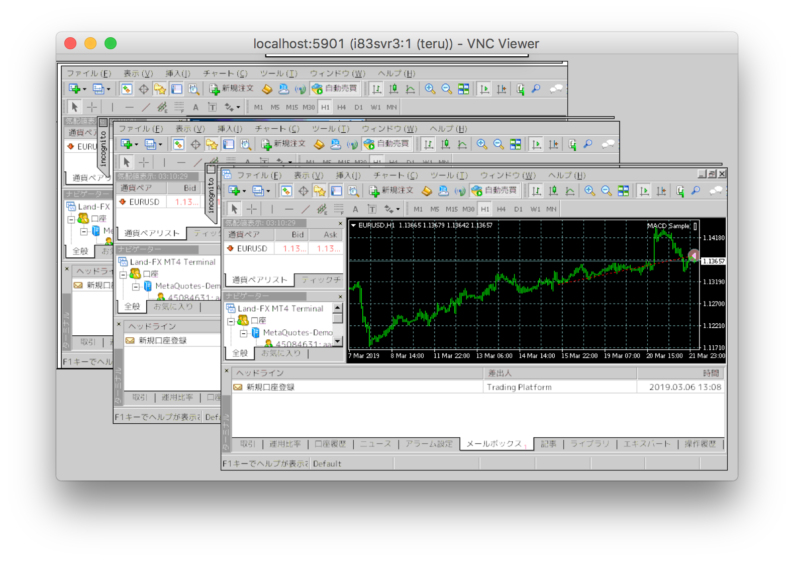
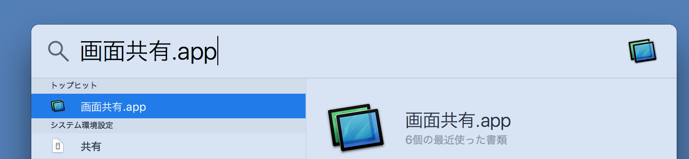
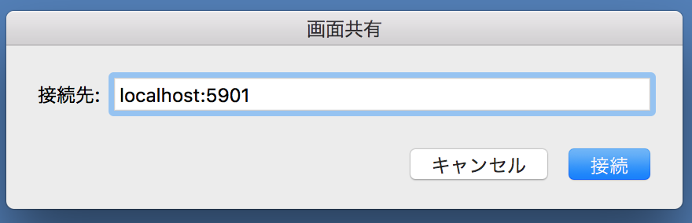
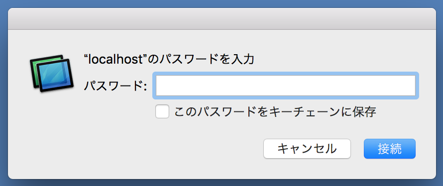
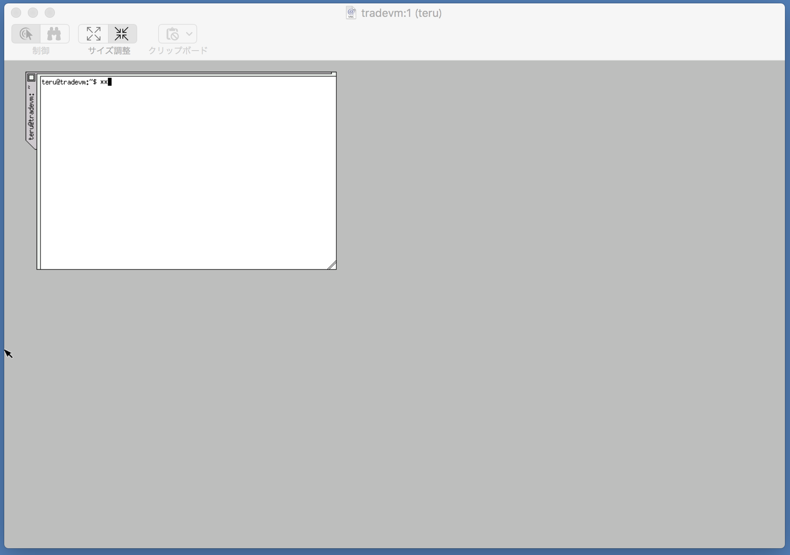
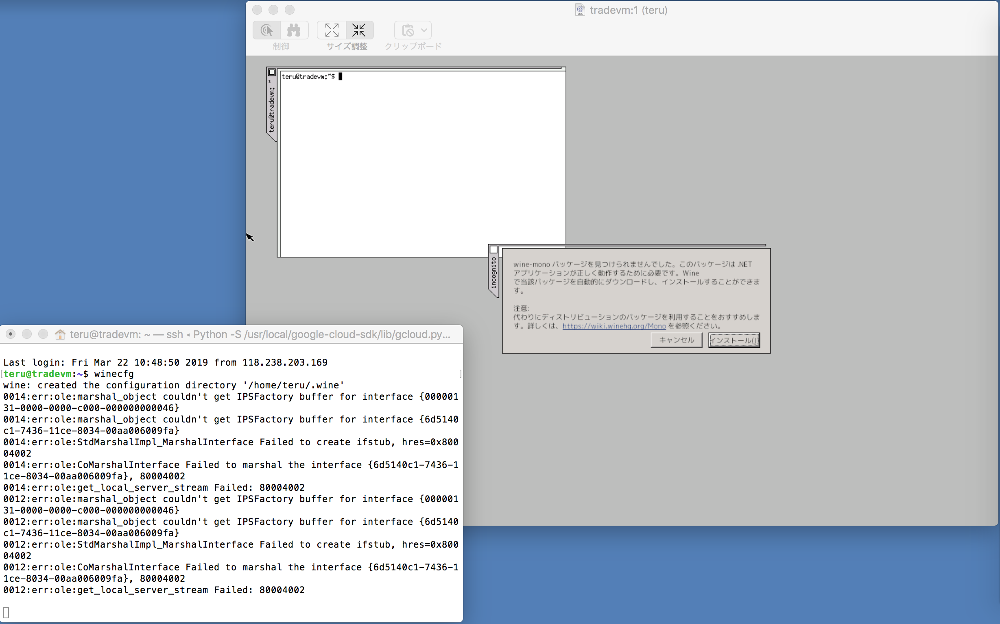
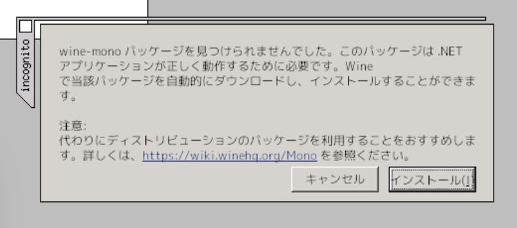
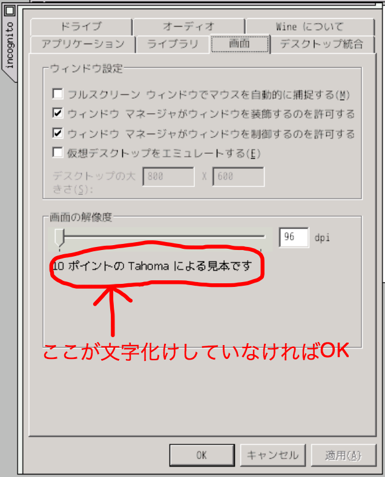
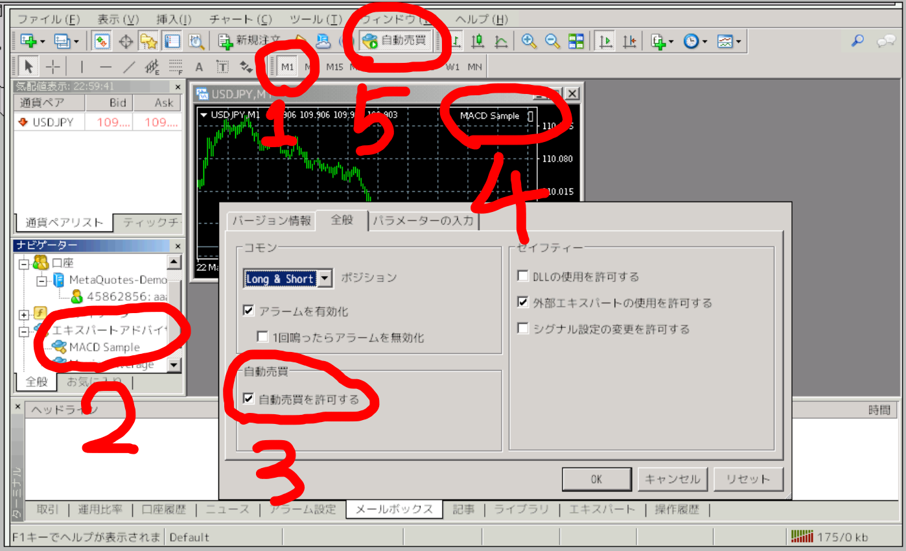

# auto-trading-support-tools
Ubuntu+Wine+MetaTrader4/5 の自動売買サーバーの監視をサポートするツール群です。
Ubuntu14〜18 くらいまではおそらく大丈夫。動作確認は主に16, 18でおこなっています。

## このツール群でできること
* まっさらな VPS に MetaTrader4(or 5) を動かすのに必要なもの一式をインストール
* 起動時にMT4/5を自動起動
* 以下のことを検知してLINEに通知
    * VPSの再起動
    * MT4/5 のクラッシュ

  
↑ こうなる。そしてこの状態を保っていることを監視するためのもの。

## 備考
* インストール・設定されるもの
    * 既存パッケージの最新化
    * 可能ならば swap 領域の作成
    * vncserver + wm2
        * 要するに最小構成のGUI
    * wine
        * Linux 上で Windows 用アプリを動かすソフト
    * 注意： MT4/5本体は GUI で操作しながらインストールする必要が有るため手動でインストールする必要有リ

* line 通知機能を使うには以下の準備が必要です
    * [LINE Developers](https://developers.line.biz/ja/services/messaging-api/)(登録無料) に登録
    * Messaging API を使うための設定
        * ↓を取得しておく必要有り
            * API にアクセスするためのトークン
            * メッセージ送信先である自分のユーザーID
                * LINE ID ではなくこういう感じの文字列 → Ucc4ba77baedb40a1603873976142c485


## Google Compute Engin の無料VMインスタンスでの例
### 前提
* Google Cloud Platform (GCP) へのの登録(無料)は完了している
    * GCP プロジェクトが作成済みでそのプロジェクトで課金が有効になっている
        * 無料枠を利用するだけでも課金の設定が必要
* [gcloud コマンド](https://cloud.google.com/sdk/downloads?hl=JA)がインストール済み
* gcloud コマンドが認証済で、使用するGCPプロジェクトがデフォルトプロジェクトになっている

### やってみよー

#### VM 作成

ローカルマシンのターミナルで以下を実行
```
$ gcloud compute instances create tradevm --machine-type f1-micro --zone us-east1-b --image-project ubuntu-os-cloud --image-family ubuntu-minimal-1804-lts --boot-disk-type pd-standard --boot-disk-size 30
.....

NAME     ZONE        MACHINE_TYPE  PREEMPTIBLE  INTERNAL_IP  EXTERNAL_IP     STATUS
tradevm  us-east1-b  f1-micro                   xx.xxx.x.x   xxx.xxx.xxx.xxx  RUNNING
```  

ディスク容量が少なすぎてパフォーマンスが・・・のようなエラーメッセージが出るが気にせず進めてOK


VMインスタンスへSSHログイン

```
$ gcloud compute ssh <任意のユーザー名>@tradevm
```

* 任意のユーザー名のところは英数字で。今後も同じものを使うのであまり投げやりな名前にしないように  
* 初回の場合はここでSSHの暗号化鍵の生成が行われるが、よしなに肯定的に進めればOK


#### 必要なものをインストール

圧縮展開ソフトのインストール  
(ここからはSSHログインしたターミナル上での作業）

```
$ sudo apt update
$ sudo apt install -y unzip
```


auto-tradeing-support-tools をダウンロード＆展開

```
$ wget https://github.com/terukusu/auto-trading-support-tools/archive/master.zip
$ unzip master.zip
$ mv auto-trading-support-tools-master auto-trading-support-tools
```


MetaTraderに必要なものをインストール

```
$ sudo ~/auto-trading-support-tools/install_required_for_mt.sh
.....
$ exit ← 言語設定を反映させるために一度切断
```

* タイムゾーンを聞かれるので 「Asia」 → 「Tokyo」 と選択する
* このスクリプトは swap領域の作成と、日本語設定と、環境変数の設定も行います
    * 自動的に変更を加えるファイル
        * ~/.bash_profile
            * 必要な環境変数追加
        * root の crontab
            * 念の為の起動時の /var/run/sshd の作成を設定(sshdの起動に必要)


#### GUI の設定を行う

再度ターミナルでSSHログイン

```
$ gcloud compute ssh --ssh-flag="-L5901:localhost:5901" teru@tradevm ← これはローカルマシンで実行
```


SSHログインしたターミナルで以下を実行
```
$ vncserver -geometry 1280x800 -localhost -nolisten tcp

Password: ← リモートからGUIに接続する際のパスワードをここで決めて入れる。軟弱なものでOK(aaaとか)
Verify:
```


この段階でVMインスタンスのGUIに接続できるようになっているので接続する。(↑のSSH接続はキープしたままで)


Mac なら画面右上の「虫めがねアイコン」→「画面共有.app」と入力し画面共有を起動。 

  

* Mac以外なら[VNC Viewer](https://www.realvnc.com/en/connect/download/viewer/)をインストールしてそれを起動)


接続先に `localhost:5901` と入力して、「接続」をクリック  




パスワードに vncserver に設定したパスワード入力して、「接続」をクリック  




接続がうまくいけばこのようにVMインスタンスの画面が表示される。  




#### Wine の設定を行う

Windows アプリを Linux 上で動かすために Wine の設定を行う。


Wineの設定 (SSHログインしたターミナルで以下を実行)
```
$ wineboot
```



* エラーメッセージが表示されるが、クラッシュしない限り問題ないので気にしなくてOK  


wine-mono と Gecko のインストールを求められるので、「インストール」を選んでインストールする。終わったらウィンドウが自動的に消えるが、それでOK  




Wineの日本語フォントの設定

```
$ cat >> .wine/user.reg
```

と入力しエンターキー。
続けて以下を入力してから 「Ctrl + d」

```
[Software\\Wine\\Fonts\\Replacements]
"MS Gothic"="VL Gothic"
"MS PGothic"="VL PGothic"
"MS Sans Serif"="VL PGothic"
"MS Shell Dlg"="VL Gothic"
"MS UI Gothic"="VL PGothic"
"Tahoma"="VL PGothic"
"\xff2d\xff33 \x30b4\x30b7\x30c3\x30af"="VL Gothic"
"\xff2d\xff33 \xff30\x30b4\x30b7\x30c3\x30af"="VL PGothic"
```

ターミナルは↓はこうなっているはず。  


Wineの日本語表示を確認  
ターミナル上で以下を実行
```
$ winecfg
```
すると↓のWine設定画面が表示されるので、画面タブを開いて赤○の部分が文字化けしていないことを確かめる。  
  
確認できたら、「OK」をクリックして終了する。


ここまでで GUI の設定は完了。Windowsアプリを動かす準備ができた。


#### MetaTrader をインストールする

SSHログインしたターミナルで以下を実行する。  
```
$ wget 'https://download.mql5.com/cdn/web/land.prime.ltd/mt4/landfx4setup.exe'
$ wine landfx4setup.exe
```
  
* MetaTrader の開発元が MetaTrader4 の配布をやめているためFXブローカー(LandFX)からダウンロードする
* 他の任意のFXブローカーの口座を扱えるので問題ない


「次へ」や「完了」をクリックして進めてインストールを完了する  
  
* インストールダイアログが消えたあとしばらくすると自動的にMetaTraderが立ち上がり、このような画面になる


#### MetaTrader にデモ口座を設定する


リアルマネーではなく架空の資金を使ってFXのデモ取引ができるデモ口座を作成する。  
リアルマネー口座を使いたい場合は予めFXブローカーで開いた口座情報をここで入れることもできる。


「取引サーバー」ダイアログで、「新しいサーバーを追加」をクリックして、「metaq」と入力してエンター
  
* すると「MetaQuotes-Demo」というサーバーが現れるので、それを選んで「次へ」
* MetaQuotes-Demo は MetaTrader の開発元である MetaQuotes社が運営する由緒正しいデモサーバー


「新しいデモ口座」を選んで「次へ」


テキトーに入力して「次へ」
  
* 連絡が来たりするわけではないのでテキトーでOK
* 口座タイプは日本円(forex-JPY)の方が扱いやすいかも


この画面で表示されている「ログインID」「パスワード」が新たに作成されたアカウントの情報。確認したら「次へ」
  
* 他のPCやスマホのMetaTraderからログインするには必要。このVMインスタンスでしかこのデモ口座を使わないならば忘れてOK


これでデモ口座での取引が可能になった。作成と同時にデモ口座にログインした状態になる
  
* 平日の市場が動いている時間帯ならばチカチカと値が動いている様子が確認できるはず


#### MetaTrader の使用メモリを削減する

通貨ペアを絞らないと説明しづらいので、ここではドル円(USD/JPY)を取引対象にすが、自分が取引したい通貨ペアに読み替えても良い。


1. チャート(グラフ)は一旦全部消す


2. 左上の「気配値表示」から取引したい通貨ペア(USDJPY)を右クリック → 「チャートに表示」を選ぶ


3. 左上の「気配値表示」を右クリック → 「全て非表示」を選ぶ。これで「気配値表示」が USDJPY だけになる

    * こういう表示になるはず
    * 他の通貨はメニューバーの「表示」→「通貨ペアリスト」からいつでも追加可能


4. メニューバーの「ツール」→「オプション」で設定を開く
    * 「サーバー」タブ
        * 「ニュースを有効にする」→ チェック外す
    * 「チャート」タブ
        * 「再表示〜チャート保存」→ チェック外す
        * 下の方の「〜最大バー数」→ ２箇所とも 2000 に設定
    * 「音声」タブ
        * 「有効にする」→ チェック外す


5. メニューバーの「ファイル」→「プログラムの終了」で終了。(Mac なら Cmd+F4 でもOK。winなら Alt+F4)


6. SSHログインしているターミナルから以下を実行
```
$ ~/auto-trading-support-tools/minimize_mt.sh
```
  
* こういう表示になるはず
* これは、無駄なニュースやメッセージや値動きの履歴を削除しています


7. SSHログインしているターミナルから以下を実行して MetaTrader を起動
```
$ ~/auto-trading-support-tools/mtctl.sh start land-fx
```
  
* こんなふうに余計なメッセージがスッキリ無くなっているかと思います


これで可能な限り使用メモリを削減できている状態


#### MetaTrader で自動売買する
MetaTrader4 は起動済みという前提で。
1. 時間足を1分間に変更。ツールバーの「M1」をクリックすることで変更できる。
    * 1分足が一番変化が早く自動売買の注文も多いので、ここではそうする

1. 画面左中段の「ナビゲーター」→「エキスパートアドバイザ」→「MACD Sample」をダブルクリックする
    * エキスパートアドバイザ(略してEA)とは自動売買プログラムのこと。

1. EAの設定ダイアログが開くので「全般」タブで「自動売買を許可する」にチェックを入れて「OK」

1. チャート右上にEA名(MACD Sample)が表示さていることを確認する

1. ツールバーの「自動売買」もクリックしてONにしておく


