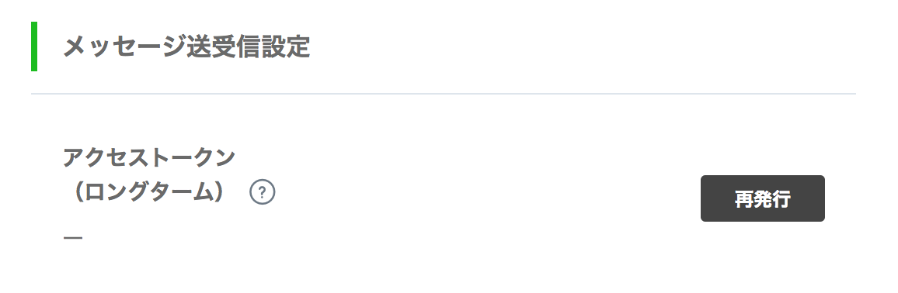
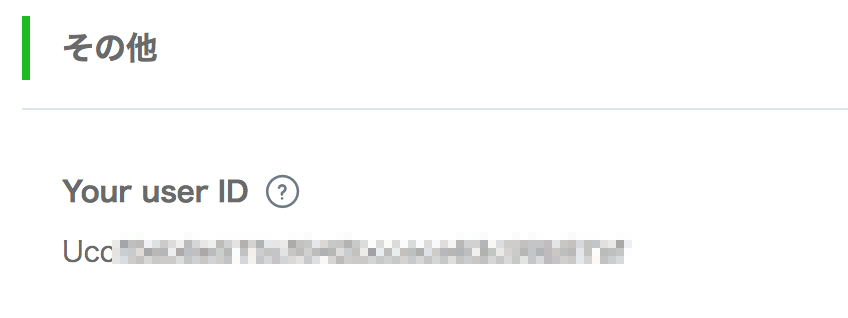

# LINE への通知設定(LINE 側)

## 概要
auto-trading-support-tools は LINE で通知を受け取るように作られています。  
LINE へのメッセージ送信には LINE の Messaging API という機能を利用します。 (無料。LINE ボットで使われる機能です。) その機能へアクセスするためのトークンと、送信先である自分の LINE ユーザーID が必要です。
ここではそれらを取得する手順を記載しています。

## 手順
### チャンネルを作成する
1. 基本的には [LINE Developers の 公式サイトに有るマニュアル](https://developers.line.biz/ja/docs/messaging-api/getting-started/) の通りにチャンネルを作成する。所要時間は３分程度。

2. 途中で気をつけるべきところは、プランを選ぶ箇所が有るので 「Developer Trial」を選ぶこと。これが無料かつ通知を送れるプランなので。

### アクセストークンを発行する

チャンネルの作成が終われば、自動的にチャンネル一覧ページに遷移するので、チャンネルを選んでチャンネル詳細ページを表示する。

ページの真ん中あたりにアクセストークン発行の箇所があるので、「再発行」をクリックしてトークンを発行する。期限は０でOK.  
  

### 自分の LINE ユーザーID を調べる

ページの最下部に自分の LINE ユーザーID が表示されているので、ここに有ることを覚えておく。  
  

### チャンネルと友だちになる

ページの下から二番目に「LINEアプリへのQRコード」が表示されているので、つうじょうの友だち登録と同じ様に友だち登録をする。
