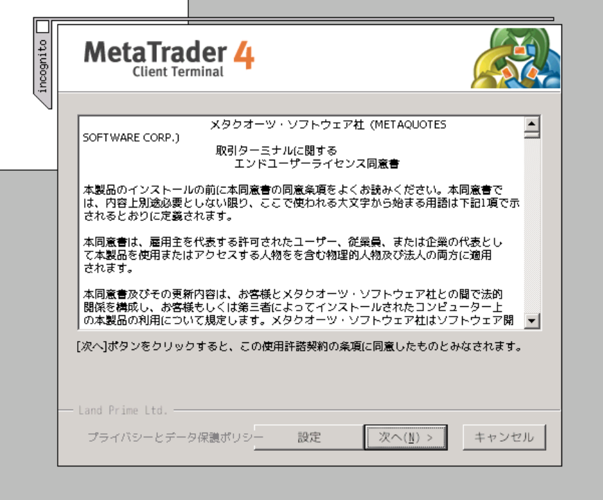
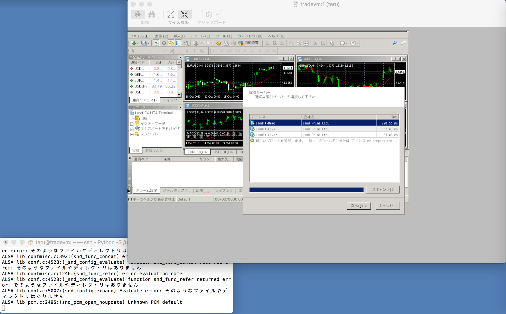
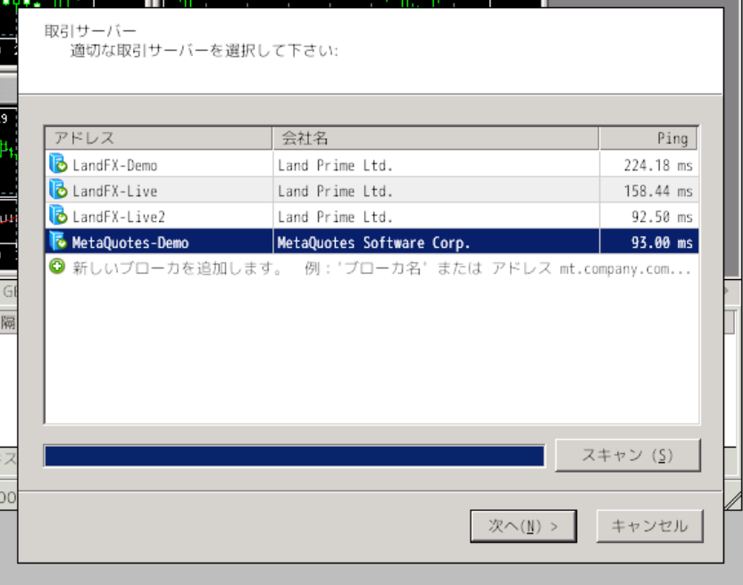
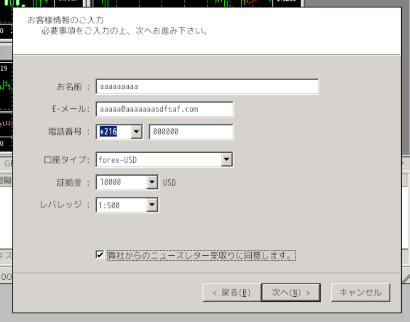
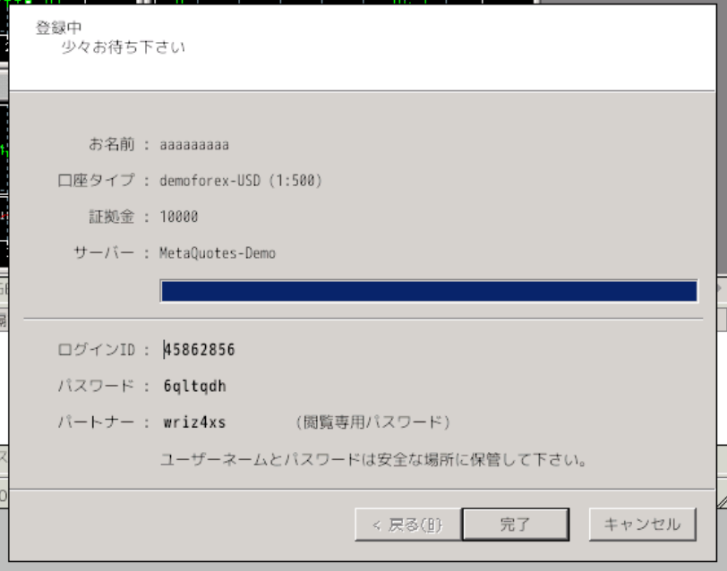
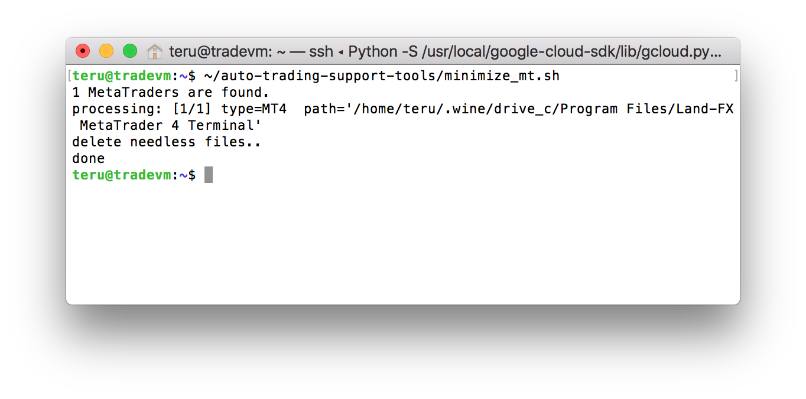
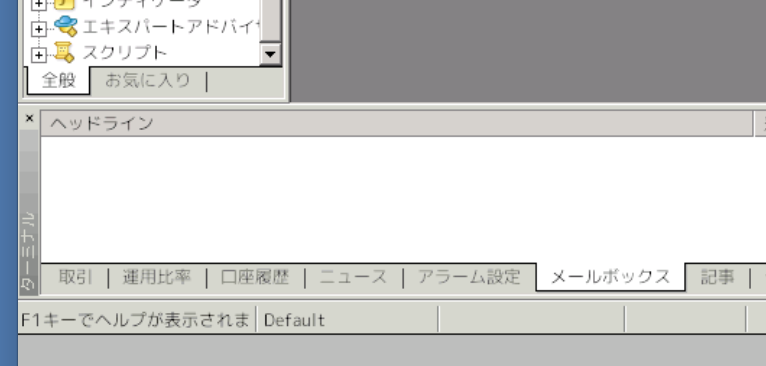

# MetaTrader をインストール・設定する

## 概要
自動売買に使用する MetaTrader というソフトをインストールして、自動売買に最適な設定を行います。
MetaTrader には 4 と 5 が有りますが、ここではまだ大勢を占めている MetaTrader4 をインストールします。
(MetaTrader4 は開発元からの配布が終わっているため、今後は急速に5へ移行が進むかもしれませんが。)


## 手順
### MetaTrader をインストール
VMインスタンスへSSHログインしたターミナル上で以下を実行
```
$ wget 'https://download.mql5.com/cdn/web/land.prime.ltd/mt4/landfx4setup.exe'
$ wine landfx4setup.exe
```
  

* MetaTrader の開発元が MetaTrader4 の配布をやめているためFXブローカー(LandFX)からダウンロードしています
* 他の任意のFXブローカーの口座を扱えるので問題ありせん


「次へ」や「完了」をクリックして進めてインストールを完了する  
  

* インストールダイアログが消えたあとしばらくすると自動的にMetaTraderが立ち上がり、このような画面になります


### MetaTrader にデモ口座を設定する

デモ口座とは、リアルマネーではなく架空の資金を使ってFXのデモ取引ができる口座です。  
リアルマネー口座を使いたい場合は予めFXブローカーで開いた口座情報をここで入れることもできるます。
デモ口座は１ヶ月程度で無効になるのでそうなった場合はこの手順を再度実行します。


「取引サーバー」ダイアログで、「新しいサーバーを追加」をクリックして、「metaq」と入力してエンター  
  

* すると「MetaQuotes-Demo」というサーバーが現れるので、それを選んで「次へ」
* MetaQuotes-Demo は MetaTrader の開発元である MetaQuotes社が運営する由緒正しいデモサーバー


現れたダイアログで、「新しい *デモ* 口座」を選んで「次へ」


テキトーに入力して「次へ」  
  

* 連絡が来たりするわけではないのでテキトーでOK
* 口座タイプは日本円(forex-JPY)の方が扱いやすいかも


この画面で表示されている「ログインID」「パスワード」が新たに作成されたアカウントの情報。確認したら「次へ」  
  

* 他のPCやスマホのMetaTraderからログインするには必要。このVMインスタンスでしかこのデモ口座を使わないならば忘れてOK


これでデモ口座での取引が可能になった。作成と同時にデモ口座にログインした状態になる  
  
* 平日の市場が動いている時間帯ならばチカチカと値が動いている様子が確認できます


#### MetaTrader の使用メモリを削減する

格安VPSでは搭載メモリが0.5GB等、少ない場合が多いのでなるべくメモリ消費を抑えます。


取引対象の通貨ペアを仮にでも決めておかないと説明しづらいので、ここではドル円(USD/JPY)を取引対象にす。適当に自分が取引したい通貨ペアに読み替えてください。


1. チャート(グラフ)は一旦全部消す


2. 左上の「気配値表示」から取引したい通貨ペア(USDJPY)を右クリック → 「チャートに表示」を選ぶ


3. 左上の「気配値表示」を右クリック → 「全て非表示」を選ぶ。これで「気配値表示」が USDJPY だけになる

    * こういう表示になるはず
    * 他の通貨はメニューバーの「表示」→「通貨ペアリスト」からいつでも追加可能


4. メニューバーの「ツール」→「オプション」で設定を開く
    * 「サーバー」タブ
        * 「ニュースを有効にする」→ チェック外す
    * 「チャート」タブ
        * 「再表示〜チャート保存」→ チェック外す
        * 下の方の「〜最大バー数」→ ２箇所とも 2000 に設定
    * 「音声」タブ
        * 「有効にする」→ チェック外す


5. メニューバーの「ファイル」→「プログラムの終了」で終了。(Mac なら Cmd+F4 でもOK。winなら Alt+F4)


6. SSHログインしているターミナルから以下を実行
```
$ ~/auto-trading-support-tools/minimize_mt.sh
```
  

* こういう表示になるはず
* これは、無駄なニュースやメッセージや値動きの履歴を削除しています


7. SSHログインしているターミナルから以下を実行して MetaTrader を起動
```
$ ~/auto-trading-support-tools/mtctl.sh start land-fx
```
  

* こんなふうに余計なメッセージがスッキリ無くなっているかと思います


これで可能な限り使用メモリを削減できている状態
