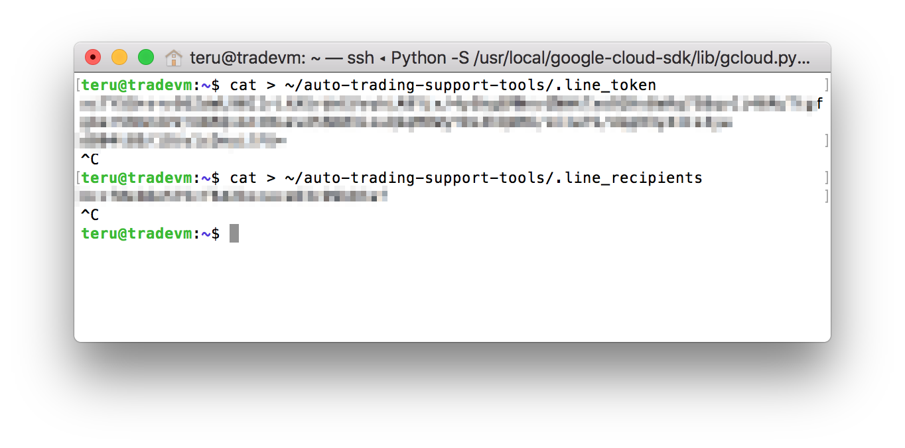
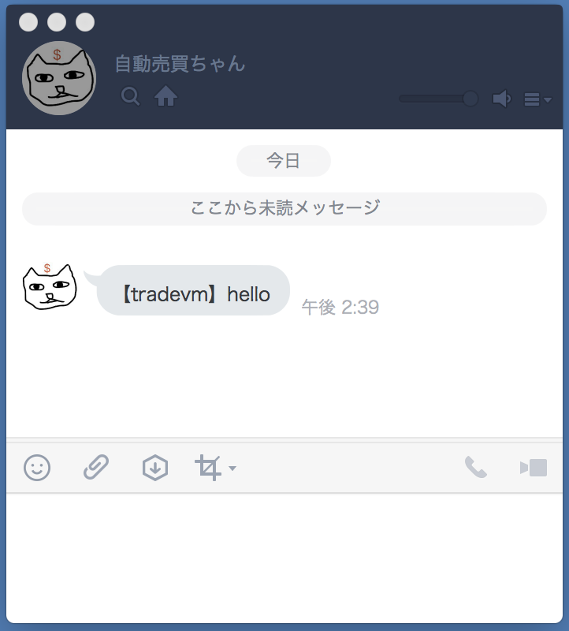

# LINE への通知設定

## 概要
auto-tradeing-support-tools は LINE で通知を受け取るように作られています。  
LINE へのメッセージ送信には LINE の WebAPI へアクセスするためのトークンと、送信先である自分の LINEユーザーIDが必要です。
それらの情報は取得済という前提で、ここではその情報をどの様に auto-trading-support-tools に設定するのかを説明します。

## 準備
* LINE Developers でLINEボットを作成し、そのボットとフレンドになっておく
* そのボット用の API アクセストークンを発行しておく
* 通知先である自分のLINEユーザーIDを調べておく
    * LINE ID ではなくこういう感じの文字列 → Ucc4ba77baedb40a1603873976142c485


## 手順

LINE の Messaging API へのアクセストークンを設定する。  
VMインスタンスにSSHログインしたターミナルで以下を実行してアクセストークンを設定ファイルへ書き込む。
```
$ cat > ~/auto-trading-support-tools/.line_token
```
続けてアクセストークンをコピー＆ペーストして、エンターキーを押して、「Ctrl + c」


LINE の通知先である自分のユーザーIDを設定する。  
ターミナルで以下を実行してユーザーIDを設定ファイルへ書き込む。
```
$ cat > ~/auto-trading-support-tools/.line_recipients
```
続けてユーザーIDをコピー＆ペーストして、エンターキーを押して、「Ctrl + c」


  

ターミナル画面は↑こうなっているはず


以下のコマンドでファイルの中身を表示できるので、正しく書き込まれているか確認する。
```
$ cat ~/auto-trading-support-tools/.line_token
$ cat ~/auto-trading-support-tools/.line_recipients
```

* 空っぽだったり、正しく書き込まれていない場合は書き込み手順を再度実行する

自分の LINE へメッセージが届くことを確認する。  
ターミナルで以下を実行する
```
$ echo hello | ~/auto-trading-support-tools/send_to_line.sh
```


ほぼリアルタイムで以下のように LINE メッセージがとどく  
  
