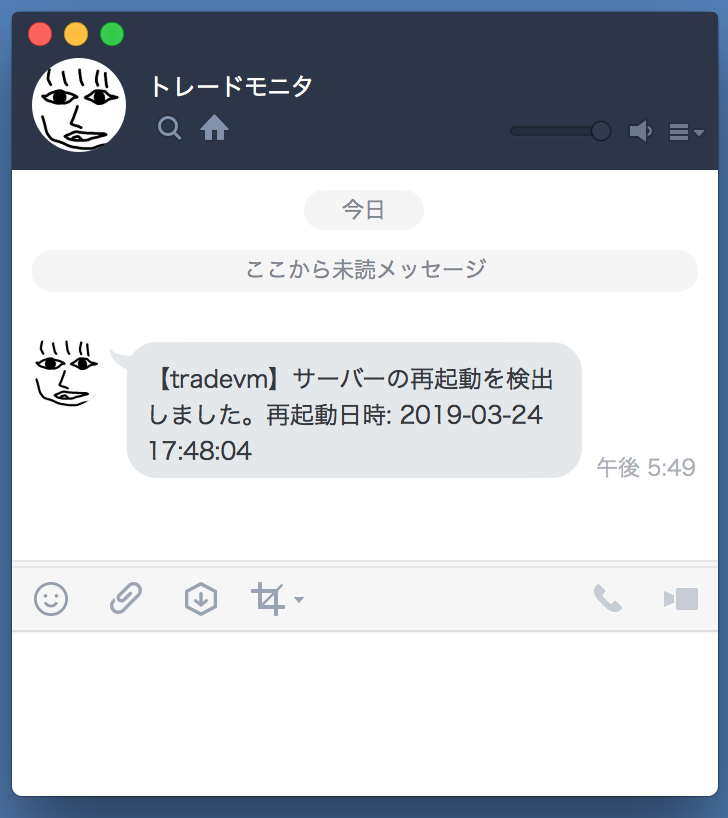

# 再起動やMT4/5の監視を設定

## 概要
自動売買で監視しして検知しなければならないことは、何をおいても以下の２つ
* サーバーが再起動したこと
    * メンテ等で勝手に再起動されるので
* MetaTrader がクラッシュしたこと
* (サーバーそのもののダウン。これはまた別の機会に)
ここではサーバー再起動とMetaTraderクラッシュを監視して、検知したら LINE へ通知する設定手順を記載しています。

## 手順
### 定期的に確認を行う設定をする  
VMインスタンスへSSHログインしたターミナルから以下を実行
```
$ crontab < ~/auto-trading-support-tools/crontab.txt
```

* この設定が追加する確認
    * 1分毎に再起動したかどうかを確認
    * 10分毎に MetaTrader がクラッシュしていないかどうかを確認
    * ついでに MetaTrader の自動起動の設定もされる :-)


正しく設定されたかを確認  
VMインスタンスへSSHログインしたターミナルから以下を実行
```
$ crontab -l

↓この様に表示されればOK
MAILTO=""

# start MetaTrader automatically at boot
@reboot $HOME/auto-trading-support-tools/mtctl.sh start  land-fx

* * * * * $HOME/auto-trading-support-tools/check_reboot.sh
*/10 * * * * $HOME/auto-trading-support-tools/check_process.sh land-fx
```


### 監視が機能しているか確認する

再起動検知が機能しているかを確認するために再起動を行う。
VMインスタンスへSSHログインしたターミナルから以下を実行
```
$ sudo reboot
```

再起動が始まりSSHは自動切断される。
しばらくしたら再起動を検知した旨が LINE に届く
  


もういちどVMインスタンスへSSHログインしてターミナルから以下を実行
```
$  ~/auto-trading-support-tools/mtctl.sh status land-fx

↓ 実行結果。今はMetaTraderが動いているはずなので、このように一覧に表示されるはず。
status=running, pid=1257, name=land-fx
```

以下を実行して MetaTrader を終了する。
```
~/auto-trading-support-tools/mtctl.sh stop land-fx
```


MetaTrader が終了していることを確認する。
```
~/auto-trading-support-tools/mtctl.sh status land-fx

↓ 実行結果。status=stopped となり終了していることを確認する。
status=stopped, pid= -, name=land-fx
```
